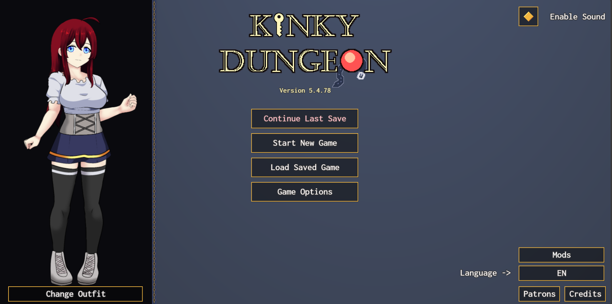
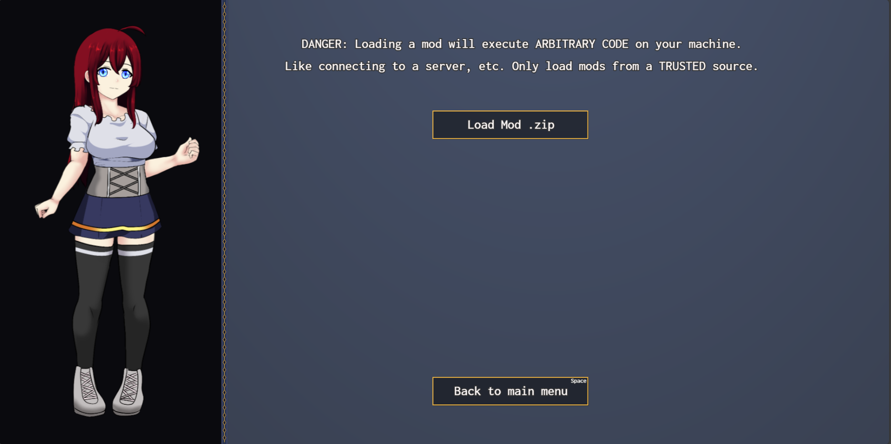
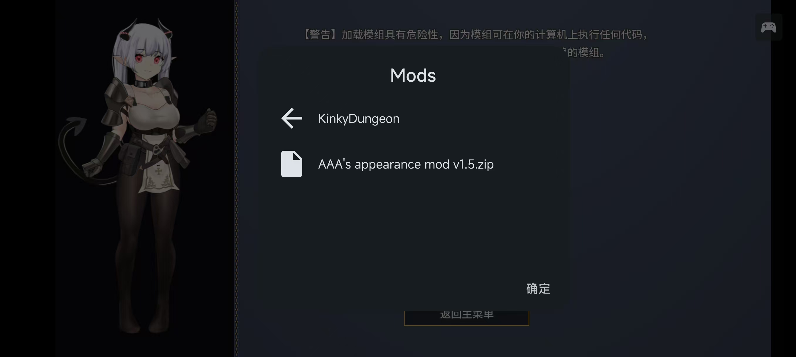
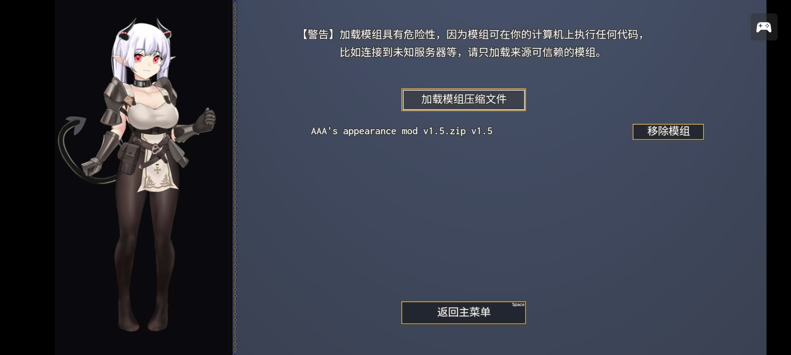

总的来说，在浏览器/本体/手机上加载 Mod 的方式是相同的

> [!TIP]
> 要在 JoiPlay 模拟器使用 Mod 功能，请阅读[注意事项](#joiplay-注意事项)

点击游戏主界面右下角的 `Mods` 按钮

点击上方 `Load Mod .zip` 按钮后会弹出文件选择器，选择 Mod 压缩文件即可

## JoiPlay 注意事项

在 [JoiPlay 官方网站](https://joiplay.net/) 下载的最新版本(1.20.023)无法弹出文件选择器，因此无法安装 Mod

在 JoiPlay 的 [Patreon](https://www.patreon.com/join/joiplay) 赞助后可以下载最新版本，新版本中添加了文件选择器

你也可以在 [百度网盘](https://pan.baidu.com/s/19ii0wG_njp2xPzOf_Gc33Q?pwd=l1ng) 下载最新版本(2025/8/9 v1.20.600)

