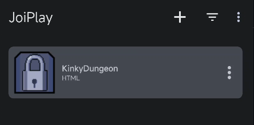

在手机上玩的前提是你需要有游戏本体文件，你可以在游戏的发布网站购买和在贴吧找资源

> [!TIP]
> [回到上一页](application.md)查看购买或贴吧搜索方式

其次，你需要下载用于在手机上游玩的 JoiPlay ([官方网站](https://joiplay.net/) | [百度网盘](https://pan.baidu.com/s/19ii0wG_njp2xPzOf_Gc33Q?pwd=L1ng))

这个游戏的本体其实相当于一个打包好的网页，网页文件保存在 `resources\app` 文件夹下

```bash
└─/kinky-dungeon-win_64
    ├─/locales
    ├─/resources
    │  └─/app # 游戏本体文件夹
    │      ├─/Backgrounds
    │      ├─/DisplacementMaps
    │      ├─/Fonts
    │      ├─/Game
    │      ├─/Music
    │      ├─/out
    │      ├─/Screens
    │      ├─/Scripts
    │      ├─/TextureAtlas
    │      ├─...
    │      ├─index.html # 游戏本体网页文件
    │      └─...
    ├─...
    ├─KinkyDungeon.exe # 游戏启动器
    └─...
```

将 `app` 文件夹下的所有文件放在手机的任意一个便于寻找且合适的位置，如此处示例放在了内部存储目录的 `JoiPlay/KinkyDungeon` 文件夹下

启动 JoiPlay，点击右上角 `+` 号展开菜单中的 `添加游戏`，在 `请选择用于开始游戏的可执行文件` 弹窗中点击 `选择`

在接下来的文件选择弹窗中找到 `index.html` 文件

> [!TIP]
> 在该示例中，`index.html` 文件路径为 `/storage/emulated/0/JoiPlay/KinkyDungeon/index.html`
>
> 在文件选择弹窗中的默认路径为 `/storage/emulated/0`，只需要依次找到并点击 `JoiPlay`、`KinkyDungeon`、`index.html` 即可

选中 `index.html` 后点击右下角 `选择` ，在接下来的弹窗中输入游戏名，游戏版本和游戏图标可以直接点击 `下一个` 跳过

添加完成后，点击首页的游戏卡片开始游戏


